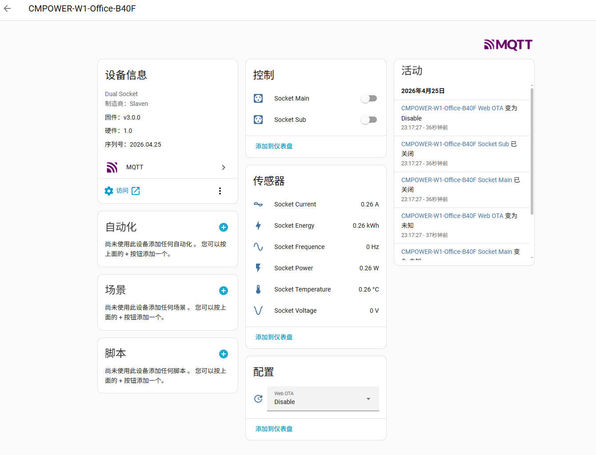
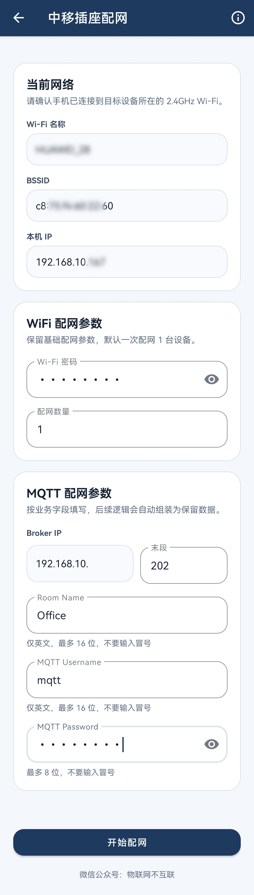
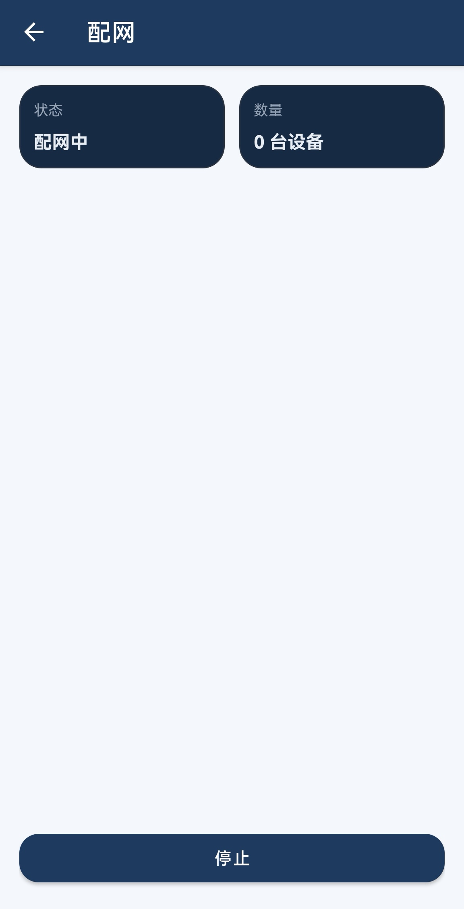
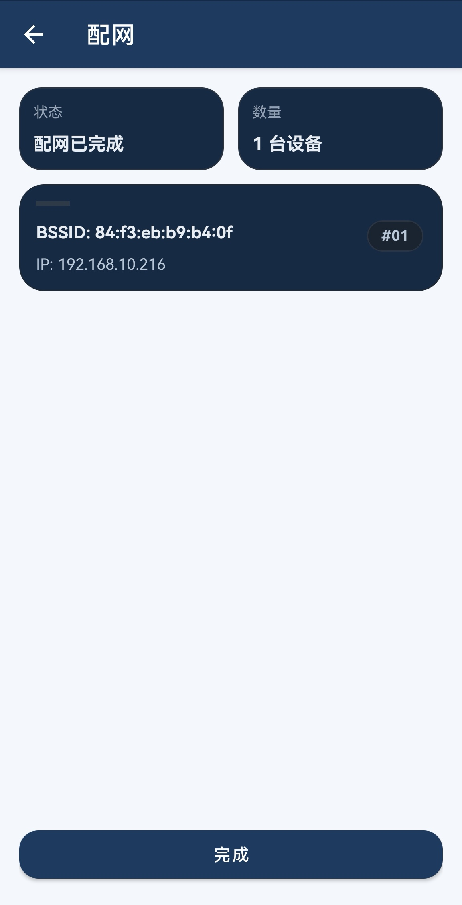

## **固件特点**

### **v3.0.0**

- 配套使用 **中移插座配网 App**，用户不再需要手动填写 EspTouch 自定义数据长串。
- App 会自动获取手机当前连接的 WiFi SSID，并封装 **Home Assistant MQTT Broker IP、Room Name、MQTT Username、MQTT Password** 后下发给设备。
- 配网流程更适合普通用户使用，只需要确认手机连接 2.4G WiFi，并按页面提示填写必要参数。

### **v2.0.0**

- 支持 **Web OTA** 功能，具体参见**第6节**内容
- 修复HA默认能源面板中无法添加**能耗**实体
- 修复无法添加多个插座

### **v1.0.1**

- 足够傻瓜，配网即用，**无需添加/修改任何 yaml 文件**，配网后 HA 中的 mqtt broker 会自动发现设备以及所有实体（包括计量）。
- 支持计量功能，无需额外校准（电压，电流，功率，电量，频率，温度），基本满足日常使用。
- 设备离线 HA 自动更新状态显示设备不可用，当设备重新上线后 HA 中自动更新状态显示设备可用（包括 HA 重启）。

# **第一部分**

## **1. 简介**

不同于[主分支版本](https://github.com/Slaven230101/CMPOWER_W1/tree/main)， 当前版本主要是为了对接 **Home Assistant** 来控制中移铁通智能插座。

固件基于乐鑫 **ESP8266_RTOS_SDK** 开发，通信协议采用 **MQTT-TCP** 方式控制插座的两个继电器。其中 **MQTT Broker** 使用 **Home Assistant** 中 **Mosquitto Broker**，从而利用 **Home Assistant** 控制主继电器和子继电器。

## **2. 配网 APP**

本项目从 **v3.0.0** 开始配套使用 **中移插座配网 App**。该 App 基于乐鑫 **Esptouch V2** 定制，用于给中移铁通智能插座下发 WiFi 信息和 Home Assistant MQTT 参数。

> 下载方式：扫描文末微信公众号二维码，关注后回复 **“中移铁通插座”** 即可获取最新固件和 App。

`使用前请先确认手机已经连接到目标设备所在的 2.4G WiFi。不建议使用 2.4G/5G 混合名称的 WiFi，否则可能导致设备无法完成配网。`

打开 App 后会直接进入配网主界面：

### **WiFi 配网参数**

App 会自动读取当前手机连接的 WiFi 名称和 BSSID，用户不需要手动填写 WiFi SSID。

用户只需要填写：

- **WiFi 密码**
- **配网数量**（默认 1 台）

### **MQTT 配网参数**

MQTT 参数用于让设备连接 Home Assistant 中的 Mosquitto Broker，并完成后续的自动发现和控制。

用户只需要填写以下内容：

- **Broker IP**：只填写 Home Assistant MQTT Broker IP 的最后一段，前面三段由 App 根据当前手机 IP 自动填充。
- **Room Name**：房间名或设备标识，用于区分多个插座，避免 Home Assistant 中设备重名。
- **MQTT Username**：Home Assistant MQTT 用户名。
- **MQTT Password**：Home Assistant MQTT 密码。

`注意：中移插座配网 App 仅适用于 v3.0.0 及之后版本固件。低于 v3.0.0 的固件仍需使用旧版 Esptouch App 配网，并在自定义数据中手动填写 broker ip:object id:mqtt username:mqtt password。`

旧版方式需要用户在 Esptouch App 的自定义数据中手动输入一整串内容，容易输错且不适合普通用户。新版 **中移插座配网 App** 已将这些内容封装成独立输入项，提交时会自动组装并通过 Esptouch V2 reserved data 下发给设备。

填写完成后点击 **开始配网**，App 会进入配网中页面：

配网完成后，App 会显示设备返回的 IP 地址。此时可以回到 Home Assistant 中查看自动发现到的插座设备和实体。

## **3. LED说明**

| LED    | 状态  | 功能                     |
| ------ | --- | ---------------------- |
| 蓝色     | 闪烁  | 设备未配网                  |
| 蓝色     | 常亮  | WiFi 已连接，但 Broker 还未连接 |
| 蓝色     | 灭   | Broker 连接成功            |
| 红色     | 常亮  | WiFi 断连                |
| 红色     | 灭   | WiFi 回连成功              |
| 白色     | 常亮  | 子继电器开                  |
| 白色     | 灭   | 子继电器关                  |
| 按键 LED | 常亮  | 主继电器开                  |
| 按键 LED | 灭   | 主继电器关                  |

`蓝色 LED 只在配网环节指示，后续只有红色 LED 指示网络情况`

## **4. 按键说明**

`双击`按键同时`开/关`主/子继电器

`单击`按键`开/关`子继电器（前提是主继电器是开的状态，否则子继电器不会开启。主继电器不开，打开子继电器没意义）

## **5. 重置说明**

`长按`按键直至红色 LED 亮起松手则重置设备

## **6. Web OTA**

当固件需要更新时可以通过 Web OTA 方式升级。通过设备**配置选项**使能（默认是不使能）

**使能**之后刷新HA网页，点击`访问`即可打开 Web OTA 网页（**不使能**情况下点击`访问`打开的是该项目地址），打开之后如下：

**如果你玩过路由器uboot刷机，那么这个界面你一定不会陌生~~**

页面下方显示的是当前设备端运行的固件版本和发行日期

Web OTA 上传固件以`sysupgrade`结尾，不要上传错固件类型

点击`Upload`后页面如下：

**升级到百分之十左右会卡顿一会属于正常现象。**

当全部上传成功会显示固件size和md5信息，用于比对固件的完整性和可靠性

最后，点击`Update`

直至出现如下界面表示升级成功

`注意：Web OTA 从 v2.0.0 版本开始支持。当前设备固件如果已经是 v2.0.0 或之后版本，后续升级可直接使用 Web OTA；如果设备仍是低于 v2.0.0 的旧版本，则需要先通过烧录方式手动升级。`

## **7. 计划开发**

- Telnet（视情况而定）

# 第二部分

## **1. 如何编译**

参考[官方指导](https://docs.espressif.com/projects/esp8266-rtos-sdk/en/latest/get-started/index.html#introduction)

注意: **ESP8266_RTOS_SDK** 使用 `release/v3.4`。

## **2. 如何烧录**

可自行编译或者使用 release 的固件 `xxx_factory.bin`

- 下载[官方工具](https://www.espressif.com/zh-hans/support/download/other-tools)
- 按图配置烧录

# 免责声明

- 本项目及其所附固件、文档仅用于学习、研究及教育目的，不得用于商业用途或其他可能侵犯第三方权益的行为。请勿将本项目用于任何非法用途。

- 刷写固件具有一定风险，可能导致设备变砖，作者对因使用本固件造成的任何损坏、数据丢失、设备故障、财产损失等概不负责。

欢迎关注微信公众号"物联网不互联"

