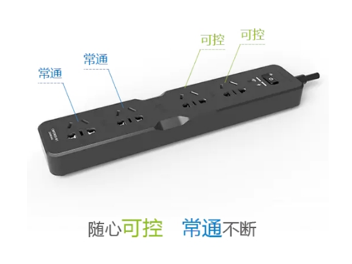
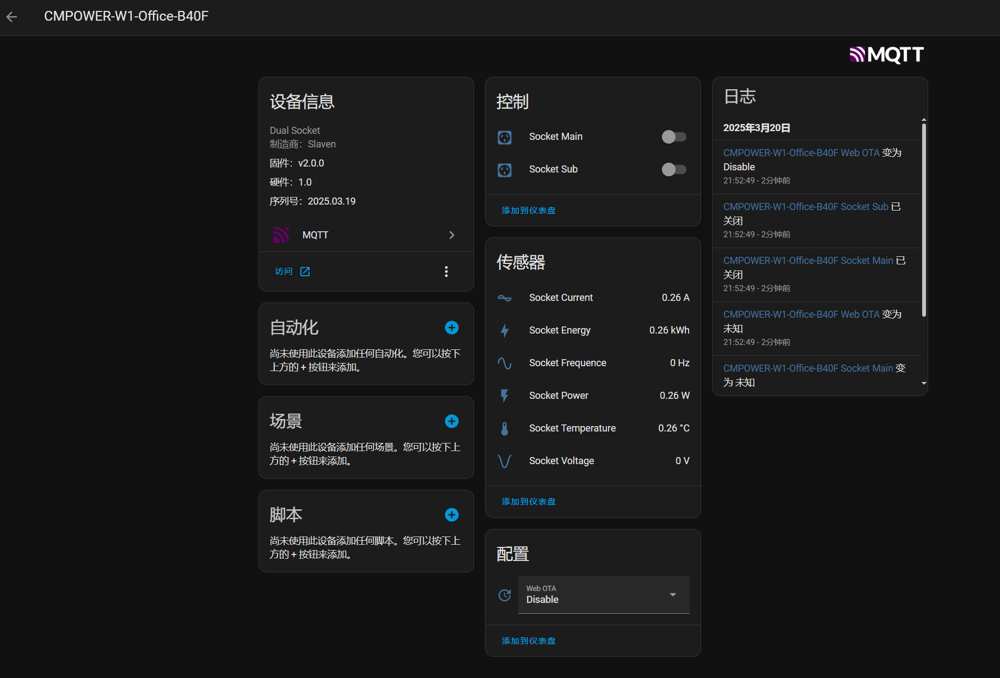

## **固件特点**

### **v2.0.0**

- 支持 **Web OTA** 功能，具体参见**第6节**内容
- 修复HA默认能源面板中无法添加**能耗**实体
- 修复无法添加多个插座

### **v1.0.1**

- 足够傻瓜，配网即用，**无需添加/修改任何 yaml 文件**，配网后 HA 中的 mqtt broker 会自动发现设备以及所有实体（包括计量）。
- 支持计量功能，无需额外校准（电压，电流，功率，电量，频率，温度），基本满足日常使用。
- 设备离线 HA 自动更新状态显示设备不可用，当设备重新上线后 HA 中自动更新状态显示设备可用（包括 HA 重启）。

# **第一部分**

## **1. 简介**

不同于[主分支版本](https://github.com/Slaven230101/CMPOWER_W1/tree/main)， 当前版本主要是为了对接 **Home Assistant** 来控制中移铁通智能插座。

固件基于乐鑫 **ESP8266_RTOS_SDK** 开发，通信协议采用 **MQTT-TCP** 方式控制插座的两个继电器。其中 **MQTT Broker** 使用 **Home Assistant** 中 **Mosquitto Broker**，从而利用 **Home Assistant** 控制主继电器和子继电器。

## **2. 配网 APP**

使用 EspTouch，详细介绍可以点击链接:
[安卓](https://github.com/EspressifApp/EsptouchForAndroid)
[IOS](https://github.com/EspressifApp/EsptouchForIOS)

可以通过手机应用市场下载安装。

手机连接 WiFi (最好是非混合的2.4G)，打开 APP 后选择 EspTouch V2 方式，输入 WiFi 密码和需要配网的设备数量。

##### **关于自定义数据说明**

由于对接 **Home Assistant，Broker IP** 通过自定义数据方式传给设备。除此之外，为了避免多个插排情况下在 **HA** 中同名，用户可以自定义 **objetc id (具体规范可以参考 HA 官网)**。除此之外，**mqtt 用户名** 和 **密码** 也需要传入，因此，自定义数据格式如下:

`"broker ip":"objetc id":"mqtt username":"mqtt password"`

使用 `:` 分隔，不能缺省否则 **Broker** 连接失败:

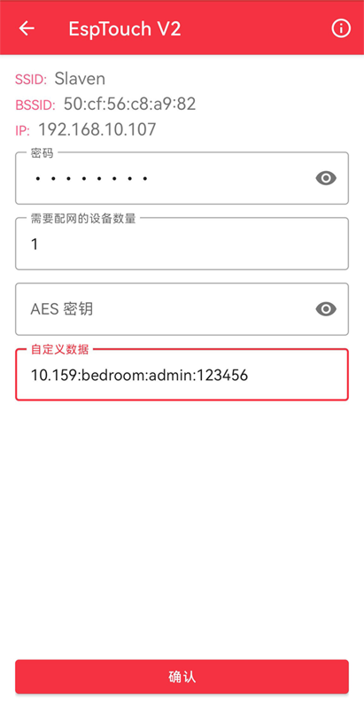

*图片以 broker ip: 192.168.10.159，自定义 object id: bedroom，username: admin，password: 123456 为例说明*

由于自定义数据总长度不能超过 32 字节，因此 broker ip 只需填写后两位，前两位默认“192.168”

## **3. LED说明**

| LED    | 状态  | 功能                     |
| ------ | --- | ---------------------- |
| 蓝色     | 闪烁  | 设备未配网                  |
| 蓝色     | 常亮  | WiFi 已连接，但 Broker 还未连接 |
| 蓝色     | 灭   | Broker 连接成功            |
| 红色     | 常亮  | WiFi 断连                |
| 红色     | 灭   | WiFi 回连成功              |
| 白色     | 常亮  | 子继电器开                  |
| 白色     | 灭   | 子继电器关                  |
| 按键 LED | 常亮  | 主继电器开                  |
| 按键 LED | 灭   | 主继电器关                  |

`蓝色 LED 只在配网环节指示，后续只有红色 LED 指示网络情况`

## **4. 按键说明**

`双击`按键同时`开/关`主/子继电器

`单击`按键`开/关`子继电器（前提是主继电器是开的状态，否则子继电器不会开启。主继电器不开，打开子继电器没意义）

## **5. 重置说明**

`长按`按键直至红色 LED 亮起松手则重置设备

## **6. Web OTA**

当固件需要更新时可以通过 Web OTA 方式升级。通过设备**配置选项**使能（默认是不使能）

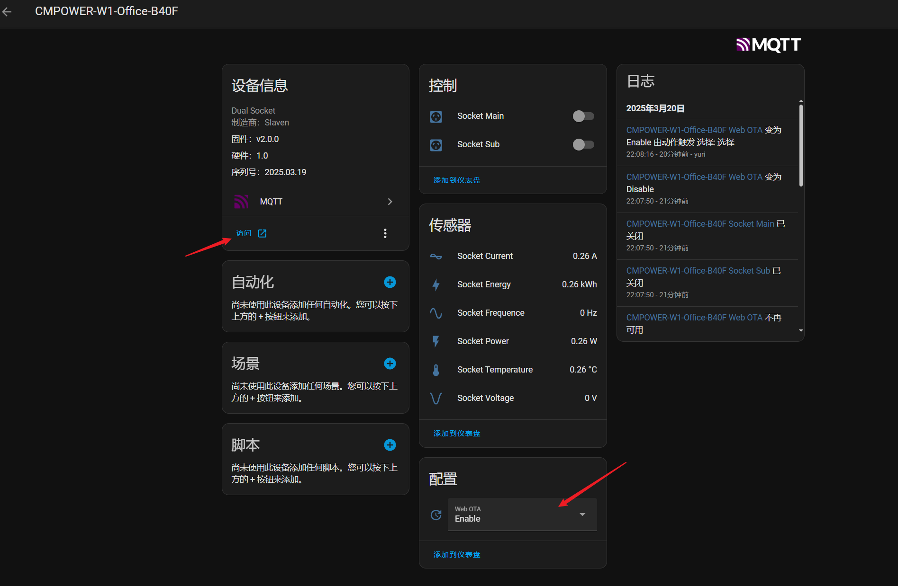

**使能**之后刷新HA网页，点击`访问`即可打开 Web OTA 网页（**不使能**情况下点击`访问`打开的是该项目地址），打开之后如下：

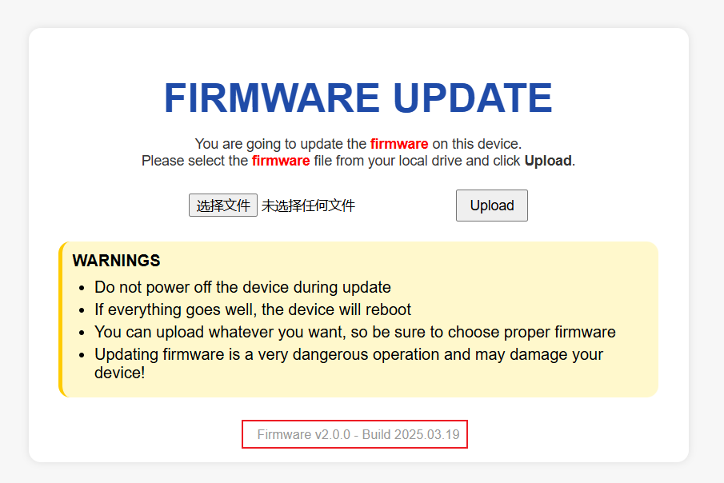

**如果你玩过路由器uboot刷机，那么这个界面你一定不会陌生~~**

页面下方显示的是当前设备端运行的固件版本和发行日期

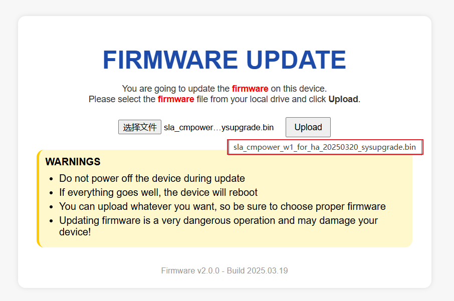

Web OTA 上传固件以`sysupgrade`结尾，不要上传错固件类型

点击`Upload`后页面如下：

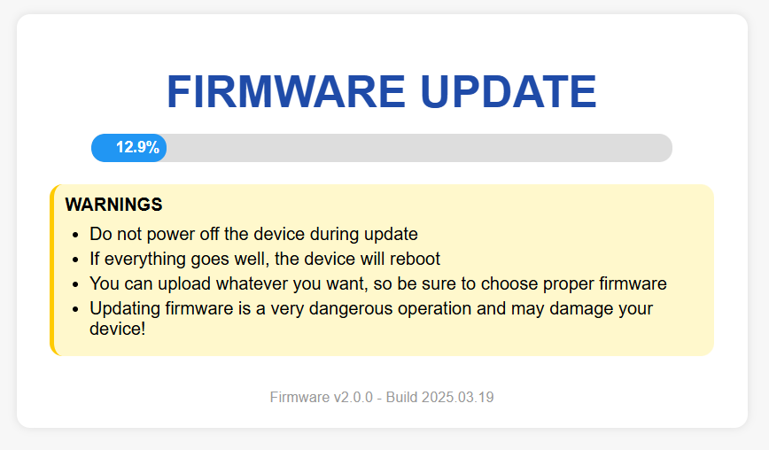

**升级到百分之十左右会卡顿一会属于正常现象。**

当全部上传成功会显示固件size和md5信息，用于比对固件的完整性和可靠性

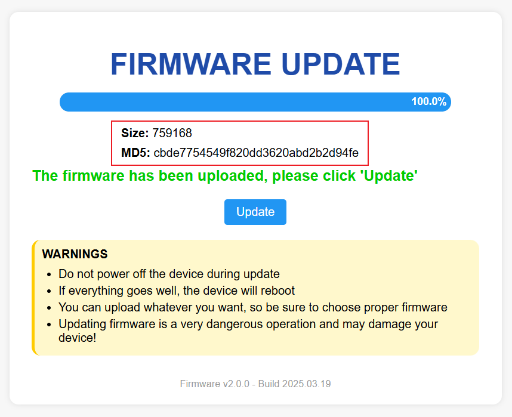

最后，点击`Update`

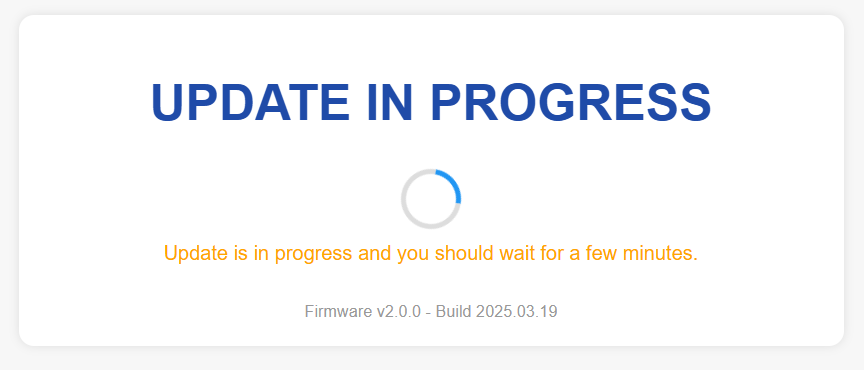

直至出现如下界面表示升级成功

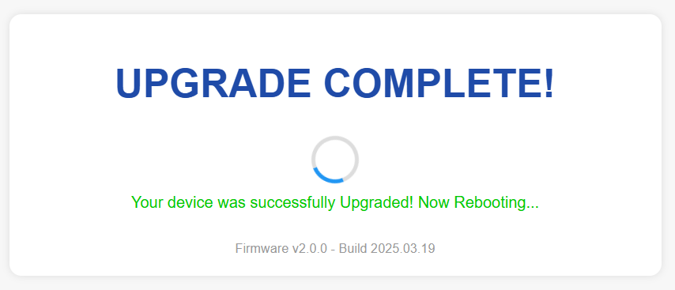

`注意：v2.0.0版本仍需通过烧录方式升级，以后版本直接通过Web OTA方式升级！！！`

`注意：v2.0.0版本仍需通过烧录方式升级，以后版本直接通过Web OTA方式升级！！！`

`注意：v2.0.0版本仍需通过烧录方式升级，以后版本直接通过Web OTA方式升级！！！`

## **7. 计划开发**

- Telnet（视情况而定）

# 第二部分

## **1. 如何编译**

参考[官方指导](https://docs.espressif.com/projects/esp8266-rtos-sdk/en/latest/get-started/index.html#introduction)

注意: **ESP8266_RTOS_SDK** 使用 `release/v3.4`。

## **2. 如何烧录**

可自行编译或者使用 release 的固件 `xxx_factory.bin`

- 下载[官方工具](https://www.espressif.com/zh-hans/support/download/other-tools)
- 按图配置烧录

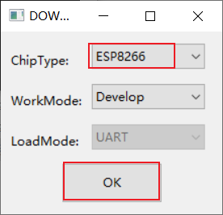

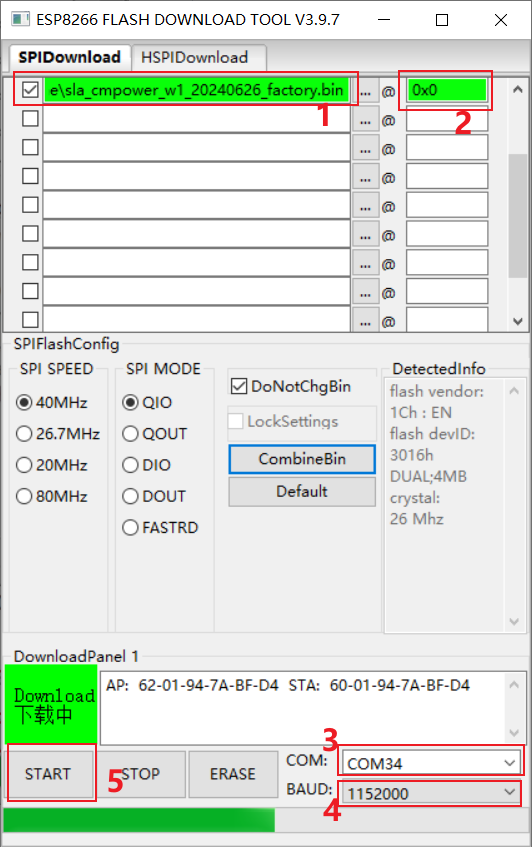

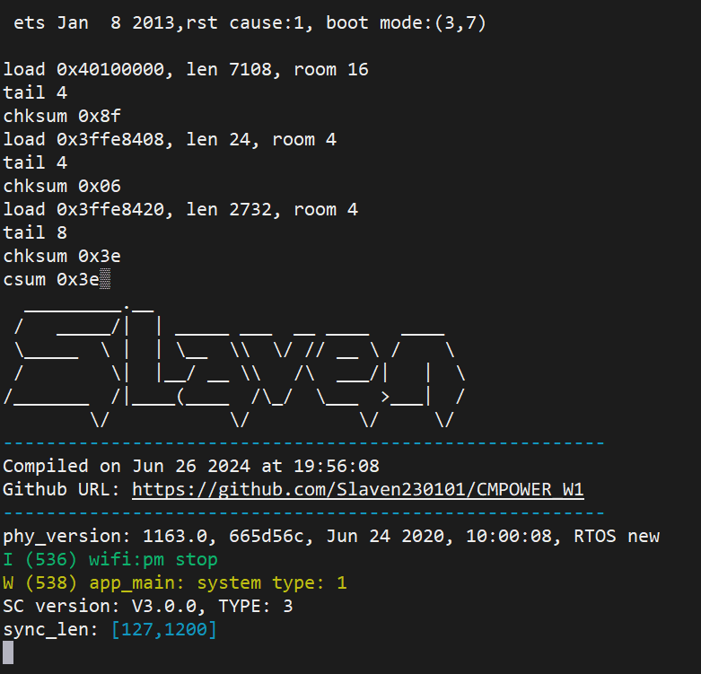

欢迎关注微信公众号
