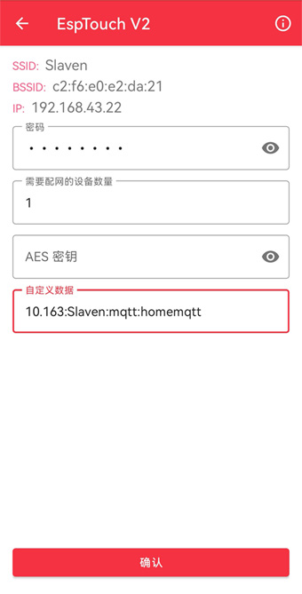

# **第一部分**

## **1. 简介**

不同于 **main** 分支，当前分支主要是为了对接 **Home Assistant** 来控制中移铁通智能插座。

固件基于乐鑫 **ESP8266_RTOS_SDK** 开发，通信协议采用 **MQTT-TCP** 方式控制插座的两个继电器。其中 **MQTT Broker** 使用 **Home Assistant** 中 **Mosquitto Broker**，从而利用 **Home Assistant** 控制主继电器和子继电器。

## **2. 配网 APP**

使用 EspTouch，详细介绍可以点击链接:
[安卓](https://github.com/EspressifApp/EsptouchForAndroid)
[IOS](https://github.com/EspressifApp/EsptouchForIOS)

可以通过手机应用市场下载安装。

手机连接 WiFi (最好是非混合的2.4G)，打开 APP 后选择 EspTouch V2 方式，输入 WiFi 密码和需要配网的设备数量。

##### **关于自定义数据说明**

由于对接 **Home Assistant**，Broker IP 通过自定义数据方式传给设备。除此之外，为了避免多个插排情况下都订阅相同的主题，用户可以自定义主题的一部分。除此之外，mqtt 用户名和密码也需要传入，因此，自定义数据格式如下:

`"broker ip":"user string":"mqtt username":"mqtt password"`

使用 `:` 分隔，不能缺省否则 Broker 连接失败:

*图片以 broker ip: 192.168.10.163，自定义 user string: Slaven，username: mqtt，password: homemqtt 为例说明*

**由于自定义数据总长度不能超过 32 字节，因此 broker ip 只需填写后两位，前两位默认“192.168”**

## **3. HA 中添加 MQTT 实体**

`configuration.yaml` 文件中添加如下配置:

	mqtt:
	  switch:
		- unique_id: main_relay
		  name: "Main Relay"
		  state_topic: "/Slaven/status"
		  command_topic: "/Slaven/set"
		  value_template: '{{ value_json.socket == "main" and value_json.onoff }}'
		  payload_on: '{"socket":"main","onoff":"on"}'
		  payload_off: '{"socket":"main","onoff":"off"}'
		  state_on: "on"
		  state_off: "off"
		  qos: 0
		  optimistic: false
		  
		- unique_id: sub_relay
		  name: "Chl Relay"
		  state_topic: "/Slaven/status"
		  command_topic: "/Slaven/set"
		  value_template: '{{ value_json.socket == "sub" and value_json.onoff }}'
		  payload_on: '{"socket":"sub","onoff":"on"}'
		  payload_off: '{"socket":"sub","onoff":"off"}'
		  state_on: "on"
		  state_off: "off"
		  qos: 0
		  optimistic: false

## **4. 订阅主题**

当前 MQTT 订阅的主题有三个，如下：

| Topic                 | 设备端 | HA 端 |
| --------------------- | --- | ----- |
| /"user string"/set    | 订阅方 | 发布方   |
| /"user string"/get    | 订阅方 | 发布方   |
| /"user string"/status | 发布方 | 订阅方   |

其中 `user string` 由配网时候 EspTouch 自定义数据传入，以刚才上图为例主题则是:

`/Slaven/set`

`/Slaven/get`

`/Slaven/status`

如果你定义为其它 `user string`，则主题根据自定义相应修改

*configuration.yaml 文件也基于此修改对应主题*

## **5. 消息负载**

- 对于 `/"user string"/set` 主题：

| Payload                         | 功能    |
| ------------------------------- | ----- |
| {"socket":"main","onoff":"on"}  | 主继电器开 |
| {"socket":"main","onoff":"off"} | 主继电器关 |
| {"socket":"sub","onoff":"on"}   | 子继电器开 |
| {"socket":"sub","onoff":"off"}  | 子继电器关 |

- 对于 `/"user string"/get` 主题：

| Payload           | 功能         |
| ----------------- | ---------- |
| {"socket":"main"} | 获取主继电器开关状态 |
| {"socket":"sub"}  | 获取子继电器开关状态 |

- 对于 `/"user string"/status` 主题：

设备收到 `/"user string"/set` 或 `/"user string"/get` 主题消息后，通过 `/"user string"/status` 主题将设备状态上报给 **Home Assistant**。

## **6. LED说明**

| LED    | 状态  | 功能                     |
| ------ | --- | ---------------------- |
| 蓝色     | 闪烁  | 设备未配网                  |
| 蓝色     | 常亮  | WiFi 已连接，但 Broker 还未连接 |
| 蓝色     | 灭   | Broker 连接成功            |
| 红色     | 常亮  | WiFi 断连                |
| 红色     | 灭   | WiFi 回连成功              |
| 白色     | 常亮  | 子继电器开                  |
| 白色     | 灭   | 子继电器关                  |
| 按键 LED | 常亮  | 主继电器开                  |
| 按键 LED | 灭   | 主继电器关                  |

`蓝色 LED 只在配网环节指示，后续只有红色 LED 指示网络情况`

## **7. 按键说明**

`短按`按键同时`开/关`主/子继电器

## **8. 重置说明**

`长按`按键直至红色 LED 亮起松手则重置设备

## **9. 计划开发**

 - MQTT-TLS
 - 计量功能
 - 本地 OTA
 
# 第二部分

## **1. 如何编译**

参考[官方指导](https://docs.espressif.com/projects/esp8266-rtos-sdk/en/latest/get-started/index.html#introduction)

注意: **ESP8266_RTOS_SDK** 使用 `release/v3.4`。

## **2. 如何烧录**

可自行编译或者使用 release 的固件 `xxx_factory.bin`

 - 下载[官方工具](https://www.espressif.com/zh-hans/support/download/other-tools)
 - 按图配置烧录
 

